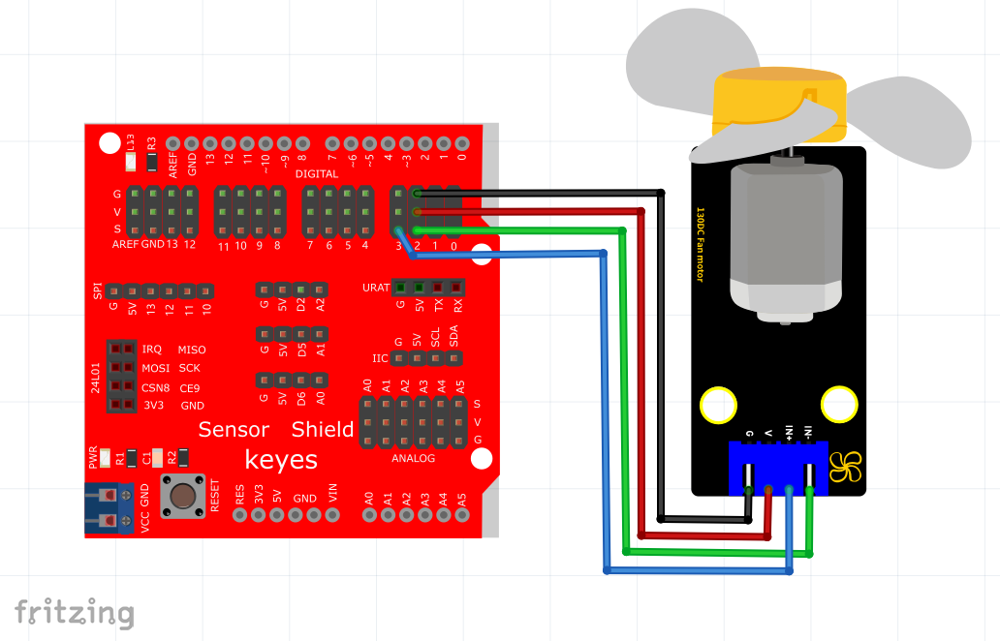

# Arduino


## 1. Arduino简介  

Arduino是一种开源电子原型平台，受到开发者和爱好者的广泛欢迎。它由硬件和软件组成，硬件包括多种开发板，如Arduino UNO、MEGA等，软件主要是Arduino IDE，用于编写和上传代码到开发板上。Arduino适用于许多项目，包括机器人、传感器控制和物联网应用。由于其简单易用的特性和庞大的社区支持，Arduino是学习编程和电子学的理想选择。  

## 2. 接线图  

  

## 3. 测试代码（测试软件版本：arduino-1.8.12）  

```cpp  
void setup(){  
    pinMode(7, OUTPUT); // 数字口7设置为输出  
    pinMode(6, OUTPUT); // 数字口6设置为输出  
}  

void loop(){  
    //设置风扇逆时针转3000毫秒  
    digitalWrite(7, LOW);  
    digitalWrite(6, HIGH);  
    delay(3000);  

    //设置风扇停止转动1000毫秒  
    digitalWrite(7, LOW);  
    digitalWrite(6, LOW);  
    delay(1000);  

    //设置风扇顺时针转3000毫秒  
    digitalWrite(7, HIGH);  
    digitalWrite(6, LOW);  
    delay(3000);  
}  
```  

## 4. 代码说明  

将管脚设置为7、6。当7输出为低电平即INA输入低电平，6输出为高电平即INB输入高电平时（输入与输出是相对的），电机顺时针旋转；当7输出为高电平，6输出为低电平时，电机逆时针旋转；当两个管脚都设置为低电平时，电机停止转动。  

## 5. 测试结果  

在控制板上上传成功，按照接线图接线，拨码开关拨打到右端上电后，小风扇先逆时针转3000毫秒，停止1000毫秒，再顺时针转3000毫秒，小风扇以较快的速度运转。


