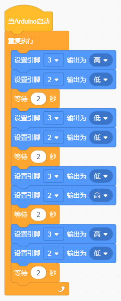

# KidsBlock

## 1. KidsBlock简介  

KidsBlock是一个面向儿童和初学者的图形化编程平台，旨在通过直观的模块化方式使编程学习变得简单有趣。用户可以通过拖拽不同的模块来设计程序，学习编程基础和电子原理，同时激发他们的创造力和逻辑思维能力。KidsBlock兼容多种硬件平台，包括Arduino，为用户提供丰富的实践项目和教育资源，适合所有年龄段的学习者，该平台鼓励用户在游戏中学习编程。  

## 2. 接线图  

  

## 3. 测试代码  

  

## 4. 代码说明  

实验中，我们这里电机IN+接管脚3，IN-接管脚2。当管脚3设置为高且管脚2设置为低时，模块上的电机正转；当管脚3设置为低且管脚2设置为高时，模块上的电机反转；当管脚3和管脚2都设置为低时，模块上的电机停止转动。  

## 5. 测试结果  

上传完成代码后，按照接线图接线，小风扇先正转2000毫秒，停止2000毫秒，再反转2000毫秒，最后再停止2000毫秒。

