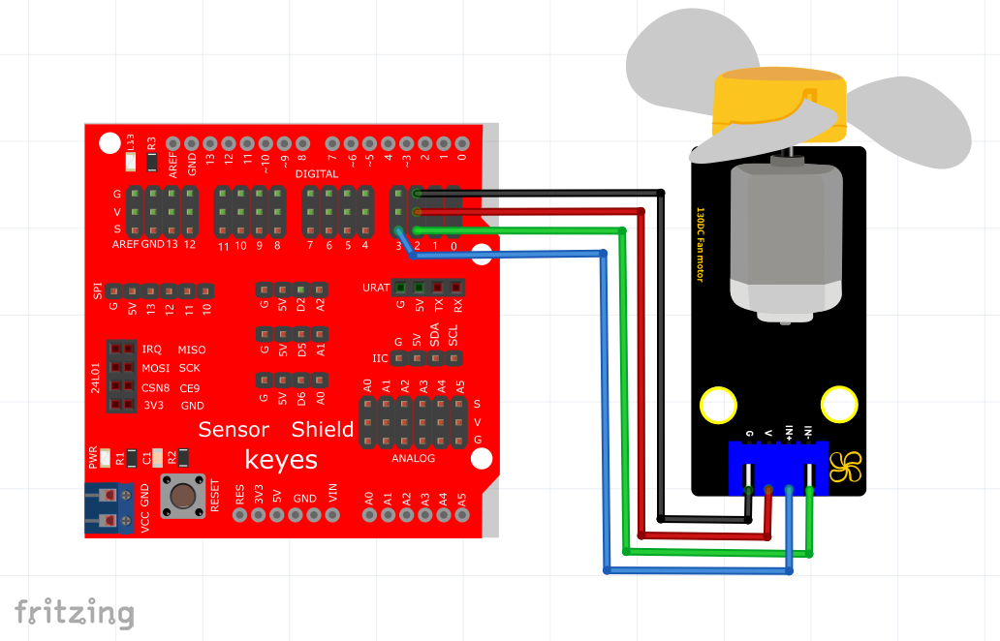
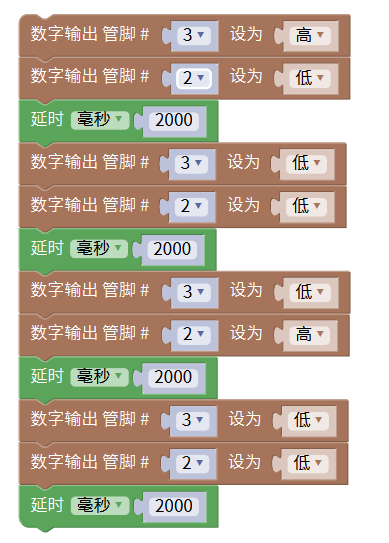

# Mixly

## 1. Mixly简介  

Mixly是一款基于Scratch和Arduino的图形化编程平台，旨在帮助用户，尤其是初学者，学习编程和电子技术。通过拖拽式的编程方式，用户可以轻松创建程序，充分发挥创造力。Mixly支持多种硬件平台，并且内置了丰富的模块和库，适合用于制作机器人、智能家居等项目。其简洁明了的用户界面和丰富的学习资源，使得Mixly成为教育和实践项目的理想选择。  

## 2. 接线图  

  

## 3. 测试代码（测试软件版本：Mixly1.2.0）  

  

## 4. 代码说明  

实验中，我们这里电机IN+接管脚3，IN-接管脚2。当管脚3设置为高且管脚2设置为低时，模块上的电机正转；当管脚3设置为低且管脚2设置为高时，模块上的电机反转；当管脚3和管脚2都设置为低时，模块上的电机停止转动。  

## 5. 测试结果  

上传完成代码后，按照接线图接线，小风扇先正转2000毫秒，停止2000毫秒，再反转2000毫秒，最后再停止2000毫秒。

