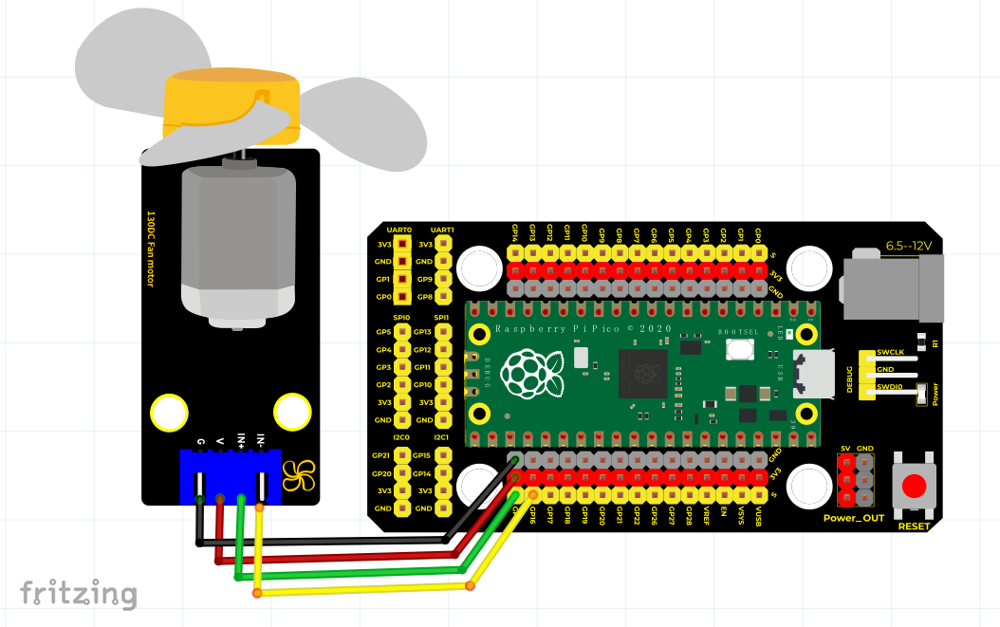

# Python


## 1. Python简介  

Python是一种高级编程语言，以其简洁的语法和强大的功能受到开发者的广泛欢迎。它支持多种编程范式，包括面向对象、命令式和函数式编程。Python因其强大的库支持和可移植性，常被用于网页开发、数据分析、人工智能、科学计算以及自动化脚本等众多领域。其简洁易懂的语法使得Python非常适合初学者学习编程，同时也受到专业开发者的青睐。Python的社区活跃，有丰富的参考资料和支持，使得开发者在遇到问题时能够迅速找到解决方案。  

## 2. 接线图  

  

## 3. 测试代码（测试软件版本：Thonny 3.3.3）  

```python  
import machine  
import utime  

external = machine.Pin(15, machine.Pin.OUT)  # 设置GPIO15为输出  
externa2 = machine.Pin(16, machine.Pin.OUT)  # 设置GPIO16为输出  

while True:  
    external.value(1)  # 小风扇正转  
    externa2.value(0)  
    utime.sleep(2)     # 延时2S  

    external.value(0)  # 小风扇停止  
    externa2.value(0)  
    utime.sleep(2)     # 延时2S  

    external.value(0)  # 小风扇反转  
    externa2.value(1)  
    utime.sleep(2)     # 延时2S  

    external.value(0)  # 小风扇停止  
    externa2.value(0)  
    utime.sleep(2)     # 延时2S  
```  

## 4. 代码说明  

1. 上述代码中使用了`machine`模块，该模块提供对硬件接口的访问。  
   - `Pin.OUT`: 设置引脚为输出模式。  
   - `Pin.IN`: 设置引脚为输入模式。  
   - `Pin.OPEN_DRAIN`: 设置引脚为开漏输出模式。  

2. 在循环中，程序通过设置GPIO15和GPIO16的电平来控制小风扇的正转和反转：  
   - 当`external.value(1)`时，小风扇正转。  
   - `utime.sleep(2)`用于延时2秒，控制转动的持续时间。  
   - 当`external.value(0)`时，小风扇停止。  

## 5. 测试结果  

按照接线图接线并上传代码后，小风扇将先正转2秒，停止2秒，再反转2秒，最后再次停止2秒。这样的循环可以有效演示风扇的控制方式。


